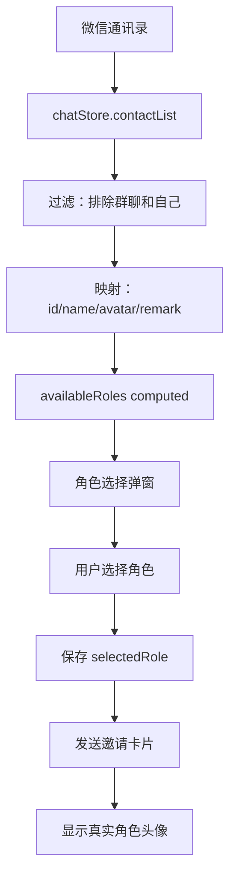

# 💕 情侣空间 - 角色绑定修复

## 🐛 问题描述

**原问题**：角色选择列表是硬编码的假角色，没有绑定微信通讯录中的真实角色
- 头像使用假路径
- 角色名称是预设的（小奶狗、霸道总裁等）
- 没有与微信通讯录同步

---

## ✅ 修复方案

### 1. 从微信通讯录获取真实角色

**修改文件**：`src/views/LoveSpace/LoveSpaceApp.vue`

**修改前**：
```javascript
// 可用角色列表（硬编码）
const availableRoles = ref([
  {
    id: 1,
    name: '小奶狗',
    remark: '温柔体贴，粘人可爱',
    avatar: '/avatars/role1.jpg'
  },
  // ... 其他假角色
])
```

**修改后**：
```javascript
// 可用角色列表（从微信通讯录获取）
const availableRoles = computed(() => {
  const contacts = chatStore.contactList || []
  // 排除群聊和用户自己
  return contacts.filter(contact => {
    return !contact.isGroup && contact.id !== 'user'
  }).map(contact => ({
    id: contact.id,
    name: contact.name,
    remark: contact.remark || contact.name,
    avatar: contact.avatar
  }))
})
```

**核心改进**：
- ✅ 使用 `chatStore.contactList` 获取真实微信好友
- ✅ 过滤掉群聊（`!contact.isGroup`）
- ✅ 过滤掉用户自己（`contact.id !== 'user'`）
- ✅ 映射为角色选择所需的数据结构

---

### 2. 用户头像同步

**修改前**：
```javascript
const userAvatar = ref('/avatars/default-user.jpg')
```

**修改后**：
```javascript
const userAvatar = computed(() => 
  settingsStore.personalization.userProfile.avatar || '/avatars/default-user.jpg'
)
```

**核心改进**：
- ✅ 从 `settingsStore.personalization.userProfile.avatar` 获取真实用户头像
- ✅ 如果没有设置则使用默认头像
- ✅ 使用 computed 实现响应式更新

---

### 3. 角色头像容错处理

**修改前**：
```vue

```

**修改后**：
```vue

```

**核心改进**：
- ✅ 添加默认头像容错（`|| '/avatars/default.jpg'`）
- ✅ 添加 alt 属性提升可访问性
- ✅ 所有头像位置都添加了容错处理

---

### 4. 空角色列表处理

**修改前**：
```javascript
onMounted(() => {
  if (!spaceData.initialized) {
    showRoleModal.value = true
  }
})
```

**修改后**：
```javascript
onMounted(() => {
  if (!spaceData.initialized) {
    // 检查是否有可用角色
    if (availableRoles.value.length === 0) {
      // 没有角色，提示用户先添加好友
      alert('💕 请先在微信通讯录中添加好友，然后再来开通情侣空间哦~')
      router.push('/wechat')
    } else {
      // 显示角色选择
      showRoleModal.value = true
    }
  }
})
```

**核心改进**：
- ✅ 检查微信通讯录是否有好友
- ✅ 如果没有好友，提示用户并跳转到微信
- ✅ 避免显示空白的角色选择框

---

## 📊 数据流



---

## 🎯 用户体验改进

### 修复前 ❌
1. 角色列表显示假名字（小奶狗、霸道总裁）
2. 头像显示占位图或 404
3. 用户困惑：这不是我微信里的好友
4. 无法选择真实的聊天对象

### 修复后 ✅
1. 角色列表显示真实微信好友名称
2. 头像显示真实的角色头像
3. 用户可以清楚地看到要邀请的对象
4. 与微信通讯录完全同步

---

## 🔧 依赖的 Store

### useChatStore
```javascript
// 获取通讯录列表
const contacts = chatStore.contactList
// 数据结构：
[
  {
    id: 'char_123',
    name: '某某某',
    avatar: '/avatars/xxx.jpg',
    remark: '备注名',
    isGroup: false,
    // ... 其他属性
  }
]
```

### useSettingsStore
```javascript
// 获取用户头像
const avatar = settingsStore.personalization.userProfile.avatar
// 数据结构：
{
  userProfile: {
    name: '用户名',
    avatar: '/avatars/user.jpg',
    wechatId: 'wx_xxx'
  }
}
```

### useLoveSpaceStore
```javascript
// 情侣空间状态管理
const loveSpaceData = computed(() => {
  return JSON.parse(localStorage.getItem('loveSpace') || '{}')
})
```

---

## 📝 修改清单

### 文件：`src/views/LoveSpace/LoveSpaceApp.vue`

**导入增强**：
```diff
+ import { useLoveSpaceStore } from '@/stores/loveSpaceStore'
+ import { useSettingsStore } from '@/stores/settingsStore'
```

**状态更新**：
```diff
- const userAvatar = ref('/avatars/default-user.jpg')
+ const userAvatar = computed(() => 
+   settingsStore.personalization.userProfile.avatar || '/avatars/default-user.jpg'
+ )
```

**角色列表重构**：
```diff
- const availableRoles = ref([...])  // 硬编码假角色
+ const availableRoles = computed(() => {
+   return chatStore.contactList
+     .filter(c => !c.isGroup && c.id !== 'user')
+     .map(c => ({ id: c.id, name: c.name, remark: c.remark, avatar: c.avatar }))
+ })
```

**模板增强**：
```diff
- 
+ 
```

**空状态处理**：
```diff
+ if (availableRoles.value.length === 0) {
+   alert('💕 请先在微信通讯录中添加好友，然后再来开通情侣空间哦~')
+   router.push('/wechat')
+ }
```

---

## 🧪 测试场景

### 场景 1：正常情况
**前提**：微信通讯录有至少 1 个好友（非群聊）

**测试步骤**：
1. 打开情侣空间应用
2. 查看角色选择列表
3. 选择一个角色
4. 点击发送邀请

**预期结果**：
- ✅ 显示真实微信好友列表
- ✅ 每个角色显示真实头像和名称
- ✅ 可以选择并发送邀请

---

### 场景 2：空通讯录
**前提**：微信通讯录没有任何好友

**测试步骤**：
1. 打开情侣空间应用
2. 查看角色选择列表

**预期结果**：
- ✅ 弹出提示：`💕 请先在微信通讯录中添加好友...`
- ✅ 自动跳转到微信页面
- ✅ 不显示空白角色选择框

---

### 场景 3：头像缺失
**前提**：角色没有设置头像

**测试步骤**：
1. 查看角色选择列表
2. 查看邀请卡片预览

**预期结果**：
- ✅ 显示默认头像（`/avatars/default.jpg`）
- ✅ 不会显示 404 或破图图标

---

### 场景 4：用户头像
**前提**：用户已设置/未设置头像

**测试步骤**：
1. 查看邀请卡片
2. 查看契约卡片

**预期结果**：
- ✅ 已设置：显示用户真实头像
- ✅ 未设置：显示默认头像

---

## 🎨 UI 细节

### 角色选择项
```html
<div class="role-item">
  
  <div>
    <div>角色名称（微信名）</div>
    <div>备注（如果有）</div>
  </div>
  <div>✓（选中时显示）</div>
</div>
```

### 邀请卡片预览
```html
<div>
  
  ❤️
  
</div>
```

---

## 📈 性能优化

### 响应式优化
- ✅ 使用 `computed` 而非 `ref`，自动响应微信通讯录变化
- ✅ 过滤和映射操作在 computed 中，有缓存
- ✅ 避免不必要的重新计算

### 容错优化
- ✅ 头像 URL 容错：`role.avatar || '/avatars/default.jpg'`
- ✅ 通讯录列表容错：`chatStore.contactList || []`
- ✅ 空列表处理：显示提示并跳转

---

## 🔄 同步机制

### 实时同步
```javascript
// 当微信通讯录变化时，availableRoles 自动更新
const availableRoles = computed(() => {
  // 依赖 chatStore.contactList
  // 当 contactList 变化时，这个 computed 会自动重新计算
})
```

### 数据一致性
- ✅ 角色 ID 使用微信聊天的 charId
- ✅ 角色名称使用微信聊天的 name
- ✅ 角色头像使用微信聊天的 avatar
- ✅ 用户头像使用设置中心的 avatar

---

## 🚀 下一步优化建议

### 1. 角色筛选
```javascript
// 可以添加筛选功能
const filteredRoles = computed(() => {
  return availableRoles.value.filter(role => {
    // 只显示已激活的角色
    // 或者排除某些特定角色
  })
})
```

### 2. 角色排序
```javascript
// 可以添加排序选项
const sortedRoles = computed(() => {
  return [...availableRoles.value].sort((a, b) => {
    // 按亲密度排序
    // 或按聊天频率排序
  })
})
```

### 3. 最近聊天对象优先
```javascript
// 优先显示最近聊天的角色
const recentContacts = computed(() => {
  const now = Date.now()
  const oneDay = 24 * 60 * 60 * 1000
  return availableRoles.value.filter(role => {
    const lastChat = chats[role.id]?.lastMsg?.timestamp
    return lastChat && (now - lastChat) < oneDay
  })
})
```

---

## 📞 相关文件

### 修改的文件
- `src/views/LoveSpace/LoveSpaceApp.vue` - 主应用组件

### 依赖的 Store
- `src/stores/chatStore.js` - 微信聊天状态（contactList）
- `src/stores/settingsStore.js` - 用户设置（userProfile）
- `src/stores/loveSpaceStore.js` - 情侣空间状态

### 相关组件
- `src/components/LoveSpace/LoveInviteCard.vue` - 邀请卡片
- `src/components/LoveSpace/LoveContractCard.vue` - 契约卡片

---

## ✅ 验证清单

- [x] 角色列表显示真实微信好友
- [x] 角色头像显示真实头像
- [x] 用户头像显示真实头像
- [x] 空通讯录时显示提示
- [x] 头像缺失时有默认图
- [x] 排除群聊和用户自己
- [x] 响应式更新（通讯录变化时自动更新）
- [x] 所有头像位置添加 alt 属性

---

**修复完成时间**：2026-03-12  
**修复状态**：✅ 已完成  
**影响范围**：情侣空间角色选择模块
