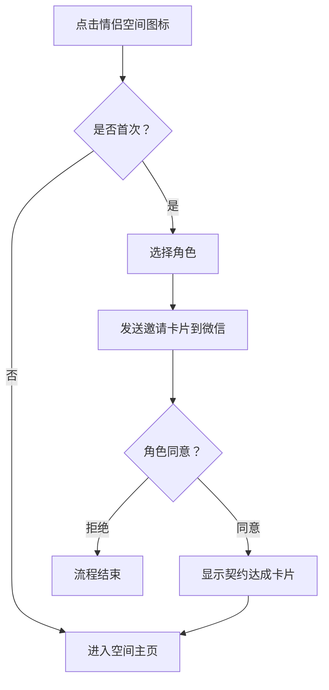
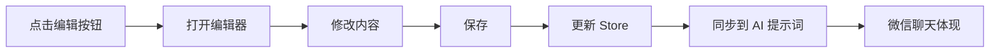

# 💕 情侣空间开发文档

## 📱 项目概述

情侣空间是一款专为恋人设计的私密社交应用，集成在微信聊天生态中，提供丰富的情侣互动功能。

---

## 🎨 一、视觉与 UI 规范

### 1.1 色彩基调

**绝对禁止**：
- ❌ 纯黑色 (#000000)

**推荐配色**：
- **主色调**：粉色系 (#ff6b9d, #ffb7c5, #ffe6eb)
- **背景色**：马卡龙色系
  - 奶油白：#fff5f7
  - 蜜桃粉：#ffe6eb
  - 薄荷绿：#e0f7fa
  - 浅婴儿蓝：#e3f2fd
- **文字色**：深灰/暖棕/深紫罗兰
  - 主要文字：#5a5a7a
  - 次要文字：#8b7aa8
  - 提示文字：#9a8fb8

### 1.2 设计规范

**卡片设计**：
```css
border-radius: 16px
box-shadow: 0 2px 20px rgba(255, 107, 157, 0.2)
backdrop-filter: blur(10px)
```

**动效规范**：
- 点击缩放：`transform: scale(0.95)`
- 悬浮提升：`transform: translateY(-4px)`
- 心跳动画：1.5s ease-in-out infinite
- 旋转动画：10s linear infinite

---

## 🔄 二、核心流程

### 2.1 开通流程



### 2.2 邀请卡片

**LoveInviteCard.vue** 组件属性：

| 属性 | 类型 | 默认值 | 说明 |
|------|------|--------|------|
| message | String | 我想和你开通专属情侣空间 | 邀请文案 |
| userAvatar | String | /avatars/default-user.jpg | 用户头像 |
| partnerAvatar | String | '' | 角色头像 |
| startDate | String | '' | 开通日期 |
| showDecline | Boolean | false | 是否显示拒绝按钮 |

**事件**：
- `accept`: 点击同意按钮
- `decline`: 点击拒绝按钮

### 2.3 契约达成卡片

**LoveContractCard.vue** 组件属性：

| 属性 | 类型 | 默认值 | 说明 |
|------|------|--------|------|
| userAvatar | String | '' | 用户头像 |
| userName | String | '我' | 用户名称 |
| partnerAvatar | String | '' | 角色头像 |
| partnerName | String | 'TA' | 角色名称 |
| startDate | String | '' | 开通日期 |
| loveDays | Number | 0 | 相恋天数 |
| contractId | String | '' | 空间编号 |

---

## 🏗️ 三、功能模块

### 3.1 空间主页 (LoveSpaceApp.vue)

**顶部羁绊区**：
- 双人头像 + 爱心连线（心跳动画）
- 相恋天数计数器
- 纪念日倒计时

**功能网格**（3 列布局）：

| 图标 | 名称 | 路由 | 说明 |
|------|------|------|------|
| 💌 | 甜蜜留言 | /message | 互留甜蜜话语 |
| 📔 | 交换日记 | /diary | AI 辅助生成日记 |
| 🎉 | 纪念日 | /anniversary | 重要日子记录 |
| 👣 | 一日足迹 | /footprint | 角色行动轨迹 |
| 📝 | 便利贴 | /sticky | 彩色便签留言 |
| ✉️ | 写信 | /letter | 慢递信件 |
| 🏠 | 两人小屋 | /house | 虚拟同居养成 |
| ❓ | 灵魂提问 | /question | 每日犀利问答 |
| 📷 | 相册 | /album | 甜蜜合照收藏 |
| 🎰 | 扭蛋机 | /gacha | 每日恋爱运势 |

**魔法生成按钮**：
- 位置：右下角悬浮
- 功能：AI 一键生成当前模块内容
- 样式：渐变粉色 + 闪光图标

---

## 📦 四、状态管理 (loveSpaceStore.js)

### 4.1 State

```javascript
{
  // 基础信息
  initialized: false,
  partner: null,
  startDate: null,
  loveDays: 0,
  
  // 功能数据
  diary: [],
  messages: [],
  anniversaries: [],
  footprints: [],
  stickies: [],
  letters: [],
  house: {},
  questions: [],
  album: [],
  gachaHistory: []
}
```

### 4.2 Getters

- `latestDiary`: 最新日记
- `nextAnniversary`: 即将到来的纪念日
- `todayFootprints`: 今日足迹
- `unansweredQuestions`: 未回答的问题
- `todayGacha`: 今日扭蛋结果

### 4.3 Actions

**核心方法**：
- `initSpace(partner)`: 初始化空间
- `addDiary(entry)`: 添加日记
- `addMessage(message)`: 添加留言
- `addAnniversary(anniversary)`: 添加纪念日
- `addFootprint(footprint)`: 添加足迹
- `addSticky(sticky)`: 添加便利贴
- `addLetter(letter)`: 添加信件
- `updateHouse(houseData)`: 更新小屋
- `addQuestion(question)`: 添加问题
- `answerQuestion(id, answer, isUser)`: 回答问题
- `addToAlbum(photo)`: 添加照片
- `rollGacha(result)`: 扭蛋
- `generateSystemPrompt()`: 生成 AI 提示词

---

## 🤖 五、AI 集成

### 5.1 系统提示词注入

**注入时机**：
- 每次微信聊天时
- 空间数据更新时

**注入格式**：
```
[情侣空间记忆]
你和用户已绑定情侣空间。
今天是你们相识的第 X 天。
你的角色是：{角色名}
用户最新日记：{日记内容}
距离{纪念日名称}还有 X 天。
你今天做了：{足迹列表}
你们的小屋是：{小屋描述}
```

### 5.2 AI 生成内容

**日记生成**：
```javascript
prompt: "请根据今天的聊天记录，生成一篇充满细节的日记，语气宠溺温柔"
```

**足迹生成**：
```javascript
prompt: "请为你自己生成今天从早到晚的 5 条生活足迹，语气要宠溺"
```

**灵魂提问**：
```javascript
prompt: "请生成一个犀利或高甜的恋爱问题，例如'如果世界末日，最后十分钟想对我说什么？'"
```

**扭蛋结果**：
```javascript
prompt: "请生成今日恋爱运势，包括宜忌、缘分指数、幸运色"
```

---

##  六、双向编辑机制

### 6.1 编辑权限

**所有模块支持**：
- ✅ AI 可编辑
- ✅ 用户可编辑
- ✅ 角色可编辑

### 6.2 编辑流程



### 6.3 冲突处理

**最后保存优先**：
- 后保存的版本覆盖先前的
- 显示保存者信息
- 保留历史版本（可选）

---

## 📱 七、微信集成

### 7.1 消息类型

**邀请卡片消息**：
```json
{
  "type": "love_space_invite",
  "content": {
    "role": { "id": 1, "name": "小奶狗", "avatar": "..." },
    "timestamp": "2026-03-12T06:03:50.000Z"
  }
}
```

**契约达成消息**：
```json
{
  "type": "love_space_contract",
  "content": {
    "contractId": "LS202603120001",
    "startDate": "2026-03-12",
    "loveDays": 0
  }
}
```

### 7.2 上下文注入

**注入方式**：
```javascript
// 在 ChatStore 中
const systemPrompt = basePrompt + loveSpaceStore.generateSystemPrompt()
```

**更新频率**：
- 实时：空间数据变更时立即更新
- 定期：每次打开微信时刷新

---

## 🎨 八、组件清单

### 8.1 已完成组件

| 组件名 | 路径 | 状态 |
|--------|------|------|
| LoveSpaceApp | src/views/LoveSpace/LoveSpaceApp.vue | ✅ |
| LoveInviteCard | src/components/LoveSpace/LoveInviteCard.vue | ✅ |
| LoveContractCard | src/components/LoveSpace/LoveContractCard.vue | ✅ |

### 8.2 待开发组件

| 组件名 | 功能 | 优先级 |
|--------|------|--------|
| LoveDiary | 交换日记 | P0 |
| LoveMessage | 甜蜜留言 | P0 |
| LoveAnniversary | 纪念日管理 | P1 |
| LoveFootprint | 一日足迹 | P1 |
| LoveSticky | 便利贴 | P1 |
| LoveLetter | 写信 | P2 |
| LoveHouse | 两人小屋 | P2 |
| LoveQuestion | 灵魂提问 | P2 |
| LoveAlbum | 相册 | P2 |
| LoveGacha | 扭蛋机 | P1 |

---

## 🔧 九、开发任务

### 9.1 路由配置

已添加：
```javascript
{
  path: '/couple',
  name: 'couple',
  component: () => import('../views/LoveSpace/LoveSpaceApp.vue')
}
```

待添加：
```javascript
// 各子模块路由
{
  path: '/couple/diary',
  name: 'couple-diary',
  component: () => import('../views/LoveSpace/LoveDiary.vue')
}
// ... 其他模块
```

### 9.2 Store 集成

已完成：
- ✅ loveSpaceStore.js 基础结构

待完成：
- [ ] 在 main.js 中注册 store
- [ ] 与 ChatStore 的提示词集成
- [ ] 数据持久化优化

### 9.3 样式统一

**全局样式变量**（建议添加到 style.css）：
```css
:root {
  --love-primary: #ff6b9d;
  --love-secondary: #ffb7c5;
  --love-bg: #fff5f7;
  --love-text: #5a5a7a;
  --love-text-light: #8b7aa8;
}
```

---

## 📊 十、数据格式

### 10.1 日记 (Diary)

```typescript
interface Diary {
  id: number
  date: string
  userContent: string
  partnerContent: string
  aiGenerated: boolean
  weather?: string
  mood?: string
  tags?: string[]
  createdAt: string
}
```

### 10.2 纪念日 (Anniversary)

```typescript
interface Anniversary {
  id: number
  name: string
  date: string
  type: 'birthday' | 'meeting' | 'first_kiss' | 'custom'
  reminder: boolean
  remindDays: number
  description?: string
}
```

### 10.3 足迹 (Footprint)

```typescript
interface Footprint {
  id: number
  date: string
  time: string
  content: string
  location?: string
  mood?: string
  aiGenerated: boolean
}
```

### 10.4 扭蛋结果 (Gacha)

```typescript
interface GachaResult {
  id: number
  date: string
  type: 'fortune' | 'advice' | 'love_word' | 'voice'
  content: string
  fortune?: {
    level: '大吉' | '中吉' | '小吉' | '末吉'
    index: number // 0-100
    advice: string
    luckyColor: string
  }
}
```

---

##  十一、开发计划

### Phase 1: 基础框架 (P0)
- [x] 空间主页
- [x] 角色选择
- [x] 邀请卡片
- [x] 契约卡片
- [ ] 甜蜜留言模块
- [ ] 交换日记模块

### Phase 2: 核心功能 (P1)
- [ ] 纪念日管理
- [ ] 一日足迹
- [ ] 便利贴
- [ ] 扭蛋机
- [ ] AI 生成集成

### Phase 3: 增强功能 (P2)
- [ ] 写信功能
- [ ] 两人小屋
- [ ] 灵魂提问
- [ ] 相册管理
- [ ] 微信深度集成

### Phase 4: 优化体验 (P3)
- [ ] 动效优化
- [ ] 性能优化
- [ ] 离线支持
- [ ] 数据备份

---

## 💡 十二、技术要点

### 12.1 本地存储

```javascript
// 数据结构
{
  loveSpace: {
    initialized: true,
    partner: {...},
    startDate: '2026-03-12T06:03:50.000Z',
    loveDays: 0,
    diary: [...],
    // ... 其他数据
  }
}
```

### 12.2 数据同步

```javascript
// 导出
const exportData = () => {
  return JSON.stringify(loveSpaceStore.$state)
}

// 导入
const importData = (data) => {
  loveSpaceStore.importData(JSON.parse(data))
}
```

### 12.3 AI 提示词生成

```javascript
const generatePrompt = () => {
  const parts = []
  
  if (store.latestDiary) {
    parts.push(`用户今天写道：${store.latestDiary.content}`)
  }
  
  if (store.nextAnniversary) {
    parts.push(`还有${store.nextAnniversary.days}天就是${store.nextAnniversary.name}`)
  }
  
  return parts.join(' ')
}
```

---

## 📝 十三、注意事项

1. **隐私保护**：所有数据本地存储，不上传云端
2. **性能优化**：大数据量时使用虚拟滚动
3. **错误处理**：优雅的降级方案
4. **兼容性**：支持 iOS Safari 和 Chrome
5. **可访问性**：支持键盘导航和屏幕阅读器

---

**文档版本**: v1.0  
**最后更新**: 2026-03-12  
**状态**: 开发中 🚧
